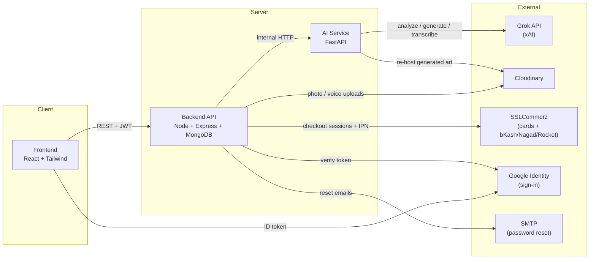

<div align="center">

# 🎨 Memory Art

**Turn a photo, a voice note, or a date you haven't forgotten into a one-of-one illustrated piece.**

An AI-powered platform that reads the mood in a personal memory and transforms it into gallery-worthy art — watercolor, oil, pencil sketch, and more — ready to preview, gift, or buy as a print, canvas, mug, or memory book.

[](https://react.dev)
[](https://nodejs.org)
[](https://fastapi.tiangolo.com)
[](https://www.mongodb.com)
[](https://tailwindcss.com)
[-000000?style=flat-square)](https://x.ai)
[](https://www.sslcommerz.com)
[](#license)

</div>

---

## What this is

Someone uploads a memory — a photo, a few lines about what happened, maybe a
voice note or a date they don't want to lose. The platform reads the mood in
it (joy, nostalgia, celebration, peace...), writes a short story, suggests a
title, and generates original artwork in the style of their choosing.
From there it's a real storefront: preview the piece framed on a wall, on a
mug, or bound into a book, add it to a cart, and check out.

Built as three independent services — a React frontend, a Node/Express API,
and a Python/FastAPI AI service wrapping the Grok API — so each can be
developed, deployed, and scaled on its own.

## ✨ Features

**Core flow**
- 📤 Upload a memory — photos, a voice note, text, and important dates
- 🧠 AI analysis — mood detection, a curated color palette, a short story,
  suggested titles, and tags
- 🖌️ Artwork generation — 7 styles: watercolor, minimalist, oil painting,
  pencil sketch, vintage poster, pop art, abstract collage
- 🛒 Storefront — gift-preview mockups, cart, real checkout via SSLCommerz
  (cards, bKash, Nagad, Rocket, internet banking), order history
- 📜 Timeline — a chronological narrative woven across all your dated
  memories

**Extras**
- ⏳ **Memory Capsule** — seal a memory to reopen on a future date (an
  anniversary, a birthday); enforced at the API layer, not just hidden in
  the UI
- 🤝 **Collaborative Memories** — share an invite link so friends and family
  can add their own photos and messages, no account required — their
  contributions feed into the AI-generated story
- 🎙️ **Voice Transcription** — a loved one's voice note, transcribed and
  folded into the memory's analysis
- ✨ **Memory Constellation** — the same memories laid out as an organic
  radial star map instead of a list

**Account, admin & commerce**
- 🔐 Forgot/reset password and Google sign-in
- 🛠️ Admin dashboard — stats, user list, order management with fulfillment
  status, contribution moderation
- 🏷️ Discount codes and gift messages at checkout
- 🔔 In-app notifications (artwork ready, contribution received, order
  status changed) and a favorites page
- 🔁 Regenerate/variations — "try another take" on any generated piece,
  grouped into one card with a history carousel
- 🔎 Search & filter your memories by keyword or mood

## 🖼️ Preview

> _Add a few screenshots or a short screen recording here once you've run
> it locally — the landing page's gallery-wall hero and the artwork
> generation flow are the best ones to show off._

## 🏗️ Architecture



## 🛠️ Tech stack

| Layer         | Stack |
|---------------|-------|
| **Frontend**  | React 19, React Router, Tailwind CSS v4, Axios, Vite, `@react-oauth/google` |
| **Backend**   | Node.js, Express, MongoDB (Mongoose), JWT auth, Multer, Nodemailer, `google-auth-library`, `express-rate-limit` |
| **AI Service**| Python, FastAPI, httpx, Grok API (chat, vision, image generation, speech-to-text) |
| **Storage**   | Cloudinary (photos, voice notes, generated artwork) |
| **Payments**  | SSLCommerz (cards + bKash/Nagad/Rocket/internet banking), BDT |
| **Auth**      | JWT + bcrypt, Google OAuth (Identity Services), SMTP-based password reset |

## 📁 Project structure

```
memory-art-platform/
├── frontend/       React app — everything the user sees and clicks
├── backend/        Express API — auth, memories, artworks, orders, capsules, admin
└── ai-service/     FastAPI service — all Grok API calls live here
```

Each folder has its own `README.md` with full setup steps and API
reference — this file is the map; those are the manuals.

## 🚀 Getting started

**Prerequisites:** Node.js 20+, Python 3.11+, a MongoDB instance (local or
[Atlas](https://www.mongodb.com/atlas)), an [xAI API key](https://console.x.ai).
Cloudinary and SSLCommerz keys are optional to start — everything runs
without them, just with uploads falling back to local disk and checkout
returning a clear "not configured" message instead of a confusing failure.
[SSLCommerz sandbox signup](https://developer.sslcommerz.com) is free and
instant. Note that SSLCommerz's callbacks POST directly to your backend, so
testing checkout end-to-end locally needs a public tunnel (e.g.
[ngrok](https://ngrok.com)) — see `backend/README.md` for the exact steps.
Google sign-in and password-reset emails are likewise optional — leave
`GOOGLE_CLIENT_ID` / `SMTP_*` blank in `backend/.env` and those two features
just don't activate rather than breaking anything else. Admin access is
granted via a comma-separated `ADMIN_EMAILS` env var, checked at signup and
login.

Start all three services, in this order (each one calls the one before it):

```bash
# 1. AI service
cd ai-service
python3 -m venv .venv && source .venv/bin/activate
pip install -r requirements.txt
cp .env.example .env   # add your XAI_API_KEY
uvicorn app.main:app --reload --port 8000

# 2. Backend
cd backend
npm install
cp .env.example .env   # MONGO_URI, JWT_SECRET, AI_SERVICE_URL, etc.
npm run dev             # http://localhost:5000

# 3. Frontend
cd frontend
npm install
cp .env.example .env   # VITE_API_URL
npm run dev             # http://localhost:5173
```

Then open `http://localhost:5173` and create an account.

## 📡 API overview

Full endpoint references live in each service's README. At a glance:

| Service | Base path | Highlights |
|---------|-----------|------------|
| Backend | `/api` | `/auth` (incl. Google + forgot/reset password), `/memories` (search/filter), `/artworks` (incl. regenerate), `/products`, `/orders`, `/orders/sslcommerz/*`, `/timeline`, `/contribute`, `/discount-codes`, `/notifications`, `/admin/*` |
| AI Service | `/` | `/analyze`, `/artwork/generate`, `/timeline`, `/transcribe` |

## 🗺️ Status

The platform is feature-complete against its original spec, every
"stretch" feature, and a full quality/enrichment pass on top: memory
upload, AI analysis, artwork generation (with regenerate/variations and
favorites), a real storefront with SSLCommerz checkout (cards, bKash,
Nagad, Rocket, internet banking, discount codes, gift messages), memory
capsules, collaborative contributions, voice transcription, the
constellation view, search & filter, forgot/reset password, Google
sign-in, an admin dashboard, and in-app notifications.

Built with heavy use of Claude — every piece was verified along the way
(clean installs, dependency audits, syntax/lint checks, boot tests) rather
than taken on faith. A few examples that surfaced along the way:

- The official SSLCommerz npm package was dropped after `npm audit`
  surfaced an unfixable CRLF-injection advisory in one of its dependencies
  — the integration calls SSLCommerz's REST API directly instead.
- Discount-code cancellation and SSLCommerz's fail/cancel callbacks used to
  each have their own copy of "release this order back to the cart" logic;
  once discount codes needed releasing too, that duplication became a real
  risk of the two paths drifting apart, so it was consolidated into one
  shared helper.
- The memory search endpoint escapes regex special characters in the
  search term before building a `RegExp` from user input — verified with a
  direct unit test, not just assumed safe.

See the per-service READMEs for the full verified-vs-untested breakdown —
in short, everything that talks to a live third-party API (Grok,
Cloudinary, SSLCommerz, Google, SMTP) is written correctly against their
documented interfaces but untested against the real thing, since none of
those are reachable from a sandboxed build environment.

## 📄 License

MIT — see [`LICENSE`](./LICENSE), or replace this section with whatever fits
your repo.
